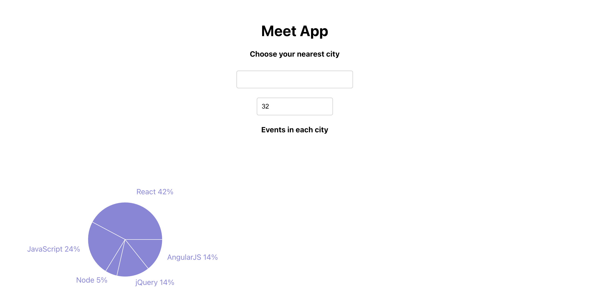

---

# 1. Project description

The meet App is a serverless, progressive web application (PWA) with React using a
test-driven development (TDD) technique.

On the main page, the User will be able to enter a City Name and Country.

The App will return the upcoming events in the selected city.
The User can then decide to see more details on the displayed events by clicking on the relevant button.

Optionally, the User can decide the number of events to be displayed (maximum 32).

On the main page, a Chart displays the number of events by city. (maximum 32)

# 2. Key features summary

- Filter events by city.
- Show/hide event details.
- Specify number of events.
- Use the app when offline.
- Add app shortcut to the home screen.
- View a chart showing the number of upcoming events by date.

# 3. Link to the online Project

Check the following url: https://xavsln.github.io/meet/

# 4. Project dependencies (e.g., JavaScript version, ESLint rules)

- HTML, CSS, JavaScript
- React
- AWS Lambda
- Serverless
- Google Calendar API
- OAuth2
- Recharts data visualization

# 5. API the project uses:

The application uses the Google Calendar API to fetch upcoming events.
